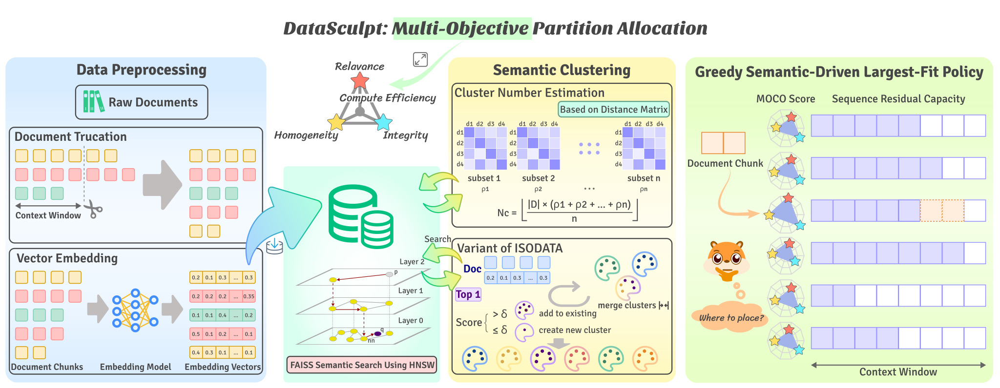
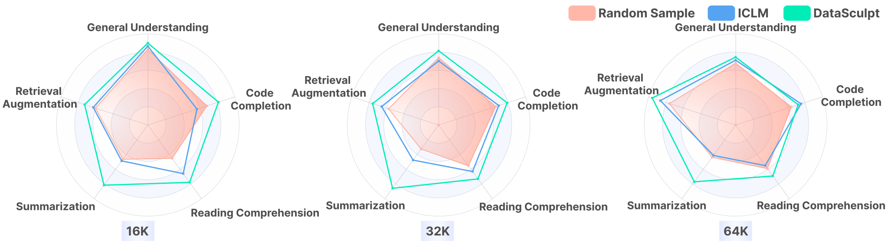

# DataSculpt: Crafting Data Landscapes for LLM Post-Training through Multi-objective Partitioning
<!-- [](https://opensource.org/licenses/MIT) -->

[](https://arxiv.org/abs/2409.00997)

Python implementation of ***DataSculpt***, a framework for constructing long-context sequences through a multi-objective partition allocation strategy. 
The capability of LLMs to effectively process extended contexts has not consistently reached its potential, emphasizing the necessity for novel methodologies to bolster their extended-context modeling proficiency. 
DataSculpt strategically aligns multiple objectives including relevance, homogeneity, integrity, and computational efficiency to optimize the data structure for long-context training. 
We achieve improvements on a 7B model including an 18.09% increase in retrieval augmentation, 21.23% in summarization, 21.27% in reading comprehension, and a 3.81% rise in code completion, all while maintaining the models' general proficiency with a 4.88\% enhancement. 
The graphic below provides an overview of DataSculpt. Check out the [paper](https://arxiv.org/abs/2409.00997) for more details. 
This codebase outputs constructed context sequences given a text dataset.



## Getting started
To get started, please clone the repo and install it:
```
git clone git@github.com:8023looker/DataSculpt.git

conda create -n datasculpt python=3.10
conda activate datasculpt
pip install -r requirements.txt
```
<!-- conda install -c pytorch/label/nightly -c nvidia faiss-gpu=1.7.4 -->
 

## Running DataSculpt on your own dataset
To run DataSculpt on your own dataset, provide data in the following format, refering to `./data_sample/input/part-00000.json`:
```
{
  "content": "This is an example of document content.",
  "docid": "falcon_talks.cam.acuk_0b1809",
  ...
}
```

## Experimental Results 
We post-train a [7B model](https://github.com/BaichuanSEED/BaichuanSEED.github.io) using the concanated sequences from DataSculpt with 16K, 32K and 64K context lengths and compare it to the baselines (random sampling and [ICLM](https://github.com/swj0419/in-context-pretraining)).



## Citation 

If this was useful to you, please cite the [paper](https://arxiv.org/abs/2409.00997):
```
@misc{lu2024datasculptcraftingdatalandscapes,
      title={DataSculpt: Crafting Data Landscapes for LLM Post-Training through Multi-objective Partitioning}, 
      author={Keer Lu and Zheng Liang and Xiaonan Nie and Da Pan and Shusen Zhang and Keshi Zhao and Weipeng Chen and Zenan Zhou and Guosheng Dong and Wentao Zhang and Bin Cui},
      year={2024},
      eprint={2409.00997},
      archivePrefix={arXiv},
      primaryClass={cs.CL},
      url={https://arxiv.org/abs/2409.00997}, 
}
```
